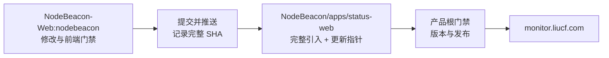

# NodeBeacon Web

NodeBeacon Web 是 NodeBeacon 的 React 19 公共状态页与 Owner 管理前端源码仓库。它 fork
自 Komari Web，保留其成熟的组件、布局、主题和响应式体验，但已经改造成只调用 NodeBeacon
Fastify REST 契约的前端。

> 本仓库不是完整产品，也不直接部署 `monitor.liucf.com`。前端改动只有在
> `xljya/NodeBeacon` 固定精确提交、通过产品根门禁并完成生产发布后才算上线。

## 30 秒理解这个仓库

| 问题 | 答案 |
| --- | --- |
| 这是什么？ | Komari-derived 的 NodeBeacon React 19 前端可维护源 |
| 负责什么？ | 公共状态页、正式 `/login`、`/admin/*`、主题、多语言和响应式 UI |
| 默认产品分支 | `nodebeacon` |
| 后端在哪里？ | `xljya/NodeBeacon` 的 `apps/api` |
| 是否独立部署？ | 否 |
| 如何进入产品？ | 提交 Web SHA，再由 `NodeBeacon` 完整引入到 `apps/status-web` 并记录固定 SHA |

如果你是 AI 或第一次参与项目，请先完整阅读本 README，再阅读
[`AGENTS.md`](AGENTS.md) 和 [`docs/NODEBEACON_GATEWAY.md`](docs/NODEBEACON_GATEWAY.md)。
不要根据 Komari 原有文件名推断 NodeBeacon 支持对应的后端能力。

## 项目来历

本仓库是 [`komari-monitor/komari-web`](https://github.com/komari-monitor/komari-web)
的 fork。`radix` 分支保留 fork 上游历史，`upstream/radix` 跟踪原项目；NodeBeacon 的产品
开发发生在 `nodebeacon` 分支。当前产品分支的来源起点为上游提交
`d859bcdd6dafb712baa0958cbc4dfa208e1013d7`。

NodeBeacon 采用这个 fork 的目的，是复用经过实际使用的视觉外壳，而不是迁移 Komari
Server。适配工作将首页数据映射到 NodeBeacon 公共契约，将登录/Admin 接到 NodeBeacon
Owner API，并移除或封锁没有 NodeBeacon 后端契约的路由与请求。

上游仓库在采用时未展示许可证文件。本仓库保留 fork、提交和来源说明，但这些技术来源
记录不替代许可证或再分发权利判断。

## 三个仓库怎样配合

| 仓库 | 角色 | 本仓与它的关系 |
| --- | --- | --- |
| [`xljya/NodeBeacon`](https://github.com/xljya/NodeBeacon) | 当前完整产品、API、契约、infra 和生产发布 | 本仓前端的唯一消费者与唯一发布方 |
| [`xljya/NodeBeacon-Web`](https://github.com/xljya/NodeBeacon-Web) | React 19 前端源 | **本仓库**；在 `nodebeacon` 开发和验证 |
| [`xljya/NodeBeacon1`](https://github.com/xljya/NodeBeacon1) | 迁移前 NodeBeacon/infra 历史 | 只用于审计和对照，不是 API 或发布来源 |

交付方向始终是单向且可追溯的：



本仓提交不会自动影响生产；产品仓库也不应只改 vendored 副本而让两仓永久分叉。

## 当前职责与路由

| 路由 | 本仓职责 |
| --- | --- |
| `/` | 公共节点状态、筛选、分组、卡片/表格视图 |
| `/instance/:id` | 转交产品仓库的 `/nodes/:id` React 18 详情页 |
| `/login` | NodeBeacon Owner 正式登录页 |
| `/admin/*` | NodeBeacon Owner 正式管理后台 |
| `/login-v2`, `/admin-v2/*` | 兼容旧影子入口并重定向到正式路径 |

是否由这些路由提供生产 HTML，最终由 `NodeBeacon` 产品仓库的 Fastify 路由和装配结果决定。
不能只因为本仓存在页面文件就声称功能已经上线。

## API 与安全边界

本前端只能使用 NodeBeacon 已实现、已文档化的 same-origin REST 契约：

- `/api/status`：白名单公共节点状态。
- `/api/site-config`：站点名称与安全主题 token。
- `/api/auth/*`：登录、会话、TOTP、GitHub OAuth 和安全回跳。
- `/api/public/nodes/:id/*`：受枚举约束的公共趋势查询。
- `/api/admin/*`：经过后端 Owner 校验的管理契约。

明确禁止：

- `/api/rpc2`、`/api/admin/client/*`、`/api/me`、`/api/logout` 等伪兼容接口。
- 浏览器直连 Prometheus 或提交任意 PromQL/labels。
- Komari Agent、Metric Store、WebSocket、插件市场、WebSSH、xterm、任意命令。
- ZIP/HTML/CSS/脚本主题或其他可执行主题内容。
- 在公共页面暴露私有 IP、账单、内部 labels、客户端版本、Owner 备注或管理配置。

`src/lib/nodebeacon.ts` 是公共展示模型的主要映射层；Admin 请求、错误与鉴权集中在
`src/lib/adminGateway.ts`，正式/旧影子路径规则集中在 `src/lib/adminPaths.ts`。不要在
页面组件中另建平行 Gateway 或绕过这些安全规则。生产构建必须通过 forbidden scan。

## 主要目录

```text
src/pages/Index.tsx       公共状态页入口
src/pages/nb-admin/       适配 NodeBeacon REST 的 Owner 页面
src/lib/nodebeacon.ts     公共 API 到展示模型的白名单映射
src/lib/adminGateway.ts   Admin 请求、错误和鉴权入口
src/lib/adminPaths.ts     正式/兼容路由与安全回跳规则
src/locales/              多语言资源
script/                   forbidden scan、i18n 同步等质量脚本
docs/                     NodeBeacon Gateway 契约说明
public/                   静态资源；不存放 Secret 或生产数据
```

## 本地开发

### 环境要求

- 推荐 Node.js 22；最低兼容 Node.js 20.19。
- 使用 npm 和已提交的 `package-lock.json`，不要改用 pnpm 或 yarn。
- 需要一个 NodeBeacon API；开发代理通过 `VITE_API_TARGET` 指向它。

```powershell
npm ci
npm run dev
```

本地开发服务器只负责前端。Fastify、Prometheus、SQLite、Kubernetes 与生产 Secret 均由
`NodeBeacon` 产品仓库负责。

## 测试与质量门禁

```powershell
npm ci
npm run lint
npm test
npm run build
npm run scan:forbidden
npm run i18n:sync:dry
git diff --check
```

UI 改动至少检查：

- `1440x1000` 与 `390x844`，并特别检查横向溢出。
- light/dark/system、Reduced Motion、键盘焦点与触摸操作。
- 浏览器控制台错误、失败请求和禁用接口请求。
- Login/Admin 的匿名访问、登录、TOTP、退出、Owner-only API 与安全回跳。
- 文案在全部 locale 中同步，而不是只修改一个语言文件。

不要修改 `dist/`、缓存或生成报告来掩盖源码问题。

## 向 NodeBeacon 交付

1. 确认位于 `nodebeacon`，并与 `origin/nodebeacon` 同步。
2. 完成功能、回归测试和全部前端门禁。
3. 提交并推送，记录完整 40 位 commit SHA。
4. 在 `xljya/NodeBeacon` 将该精确提交完整引入 `apps/status-web`。
5. 更新产品仓库的 `apps/status-web/NODEBEACON_WEB_COMMIT`。
6. 在产品仓库运行 lint、typecheck、test、build、Chromium E2E 和 forbidden scan。
7. 需要上线时，由产品仓库升版本、部署 RS1000、真实浏览器验收并写发布记录。

只有第 7 步完成后，才能说本仓前端已经发布到生产。

## 分支与上游同步

- `nodebeacon`：NodeBeacon 唯一产品开发分支。
- `radix`：保留的 fork 上游历史，不用于日常产品开发。
- `upstream/radix`：Komari Web 跟踪分支。

上游同步是显式的架构工作，不是普通依赖升级。同步前要重新检查 API 假设、路由、公共字段、
禁用能力、依赖和许可证状态；不要直接把 `radix` 合入 `nodebeacon` 后交付生产。
